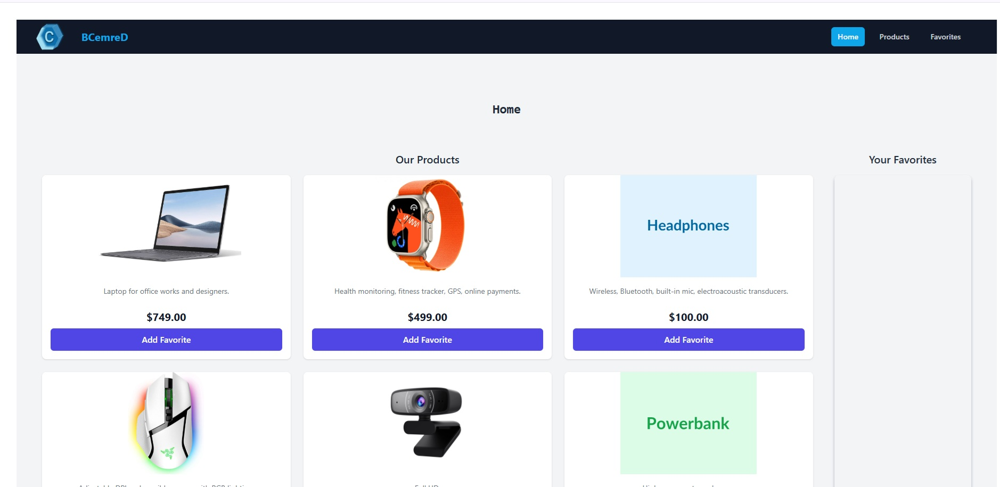
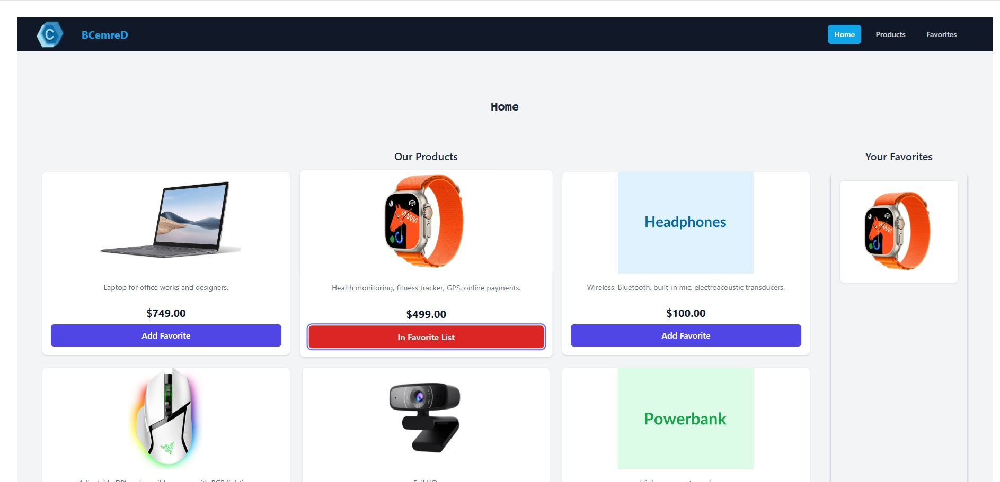
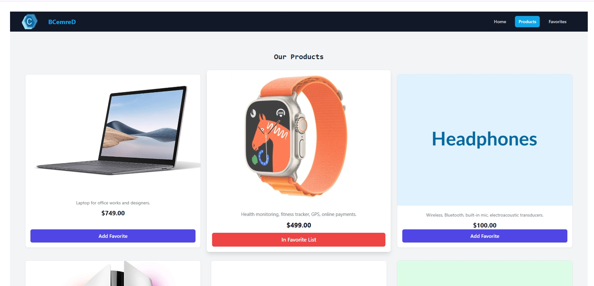
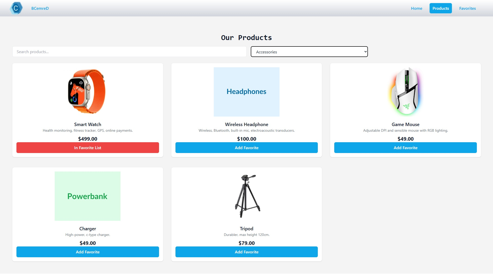
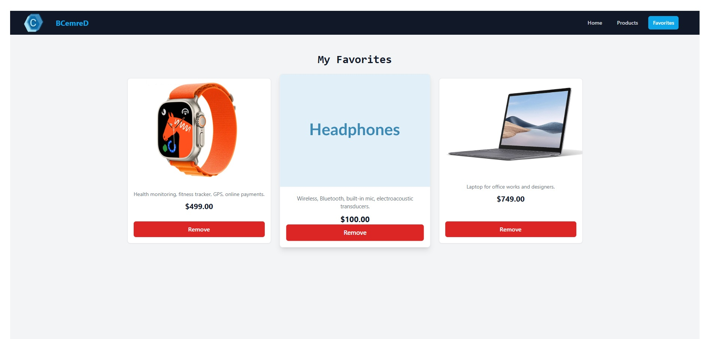
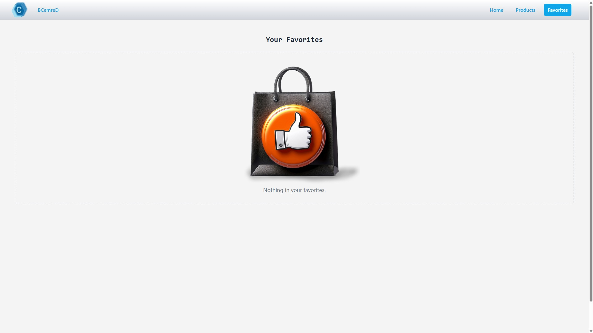

# 🛍️ React Product Listing App

This is a simple product listing application built with React, TailwindCSS, Zustand, and React Router. Users can browse adn filter products, add them to their favorites, and view them on a distinguish page.

## 🚀 Features
- Product grid layout with responsive design
- Add/remove products from favorites using Zustand
- Persistent global state management
- Routing with React Router
- Error handling for image loading
- Fav sidebar preview
- Filter products by categories
- Mini test via List and Babel

## 📸 Preview
### Main page:

### When product is added favorite on main page:

### Product page:

### Filter bar:

### Favorite page:

### Empty Favorite page:

## 🧠 Technologies
- React
- TailwindCSS
- Zustand
- React Router
- Vite
- List

## 🔗 Live Demo

