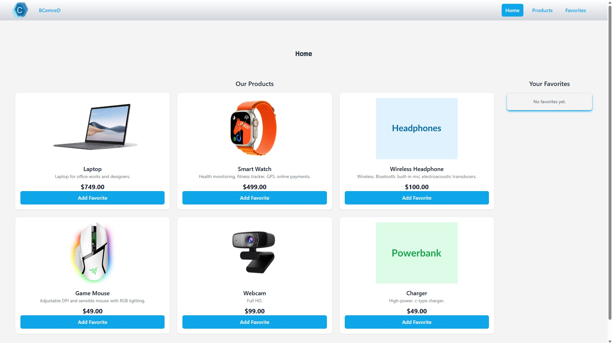
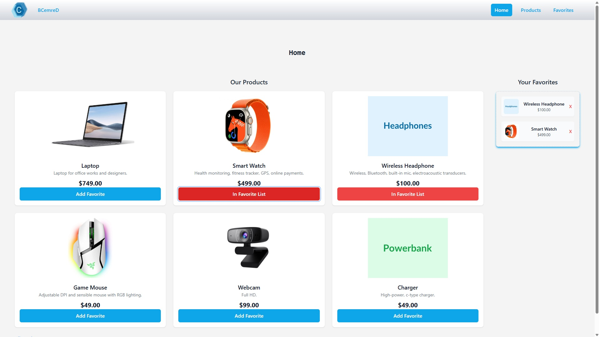
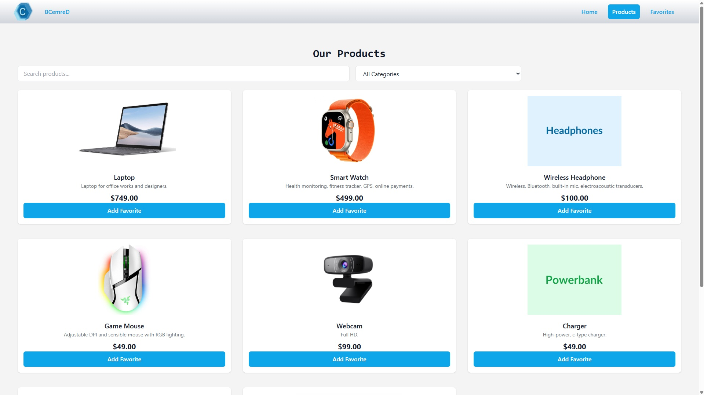
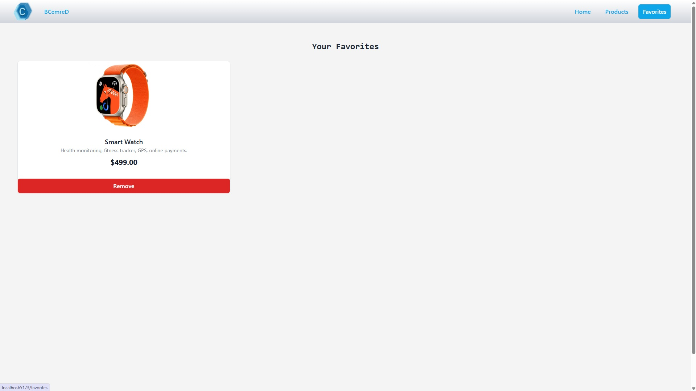

# 🛍️ React Product Listing App

This is a simple product listing application built with React, TailwindCSS, Zustand, and React Router. Users can browse adn filter products, add them to their favorites, and view them on a distinguish page.

## 🚀 Features
- Product grid layout with responsive design
- Add/remove products from favorites using Zustand
- Persistent global state management
- Routing with React Router
- Error handling for image loading
- Fav sidebar preview
- Filter products by categories
- Mini test via List and Babel

## 📸 Preview
### Main page:

### When product is added favorite on main page:

### Product page:

### Filter bar:

### Favorite page:

### Empty Favorite page:


## 🧠 Technologies
- React
- TailwindCSS
- Zustand
- React Router
- Vite
- List

 ## Testing Strategy
This project uses a multi-layered testing approach to ensure the reliability and stability of the application. Tests are divided into three main categories:

### Unit Tests
Unit tests verify that individual components or functions behave as expected in isolation.

Tools: Jest, React Testing Library

Example:
FavoriteButton.test.jsx: Tests the logic of the FavoriteButton component using a mocked Zustand store.
ProductCard.test.jsx: Verifies correct rendering of product details and interaction with mocked sub-components.

Zustand state is mocked with jest.mock() and helper functions such as getMockFavoriteStore() to simulate store behavior.

### Integration Tests
Integration tests check how multiple components interact together.

Tools: Jest, React Testing Library

Example:
ProductPage.test.jsx: Tests product filtering logic and rendering based on user input.
The test interacts with UI elements like the search bar and verifies filtered output.

Zustand store (useProductStore) is mocked to provide consistent and predictable state.

### End-to-End (E2E) Tests
End-to-end tests simulate user behavior in a real browser environment to ensure that the entire application works as expected.

Tools: Cypress

Example:
product-page.cy.js: Navigates to the homepage, types in the search bar, and asserts visible products.

⚠️ These tests do not import or render React components. Instead, they interact with the running application (cy.visit()), just like a user would.

📁 Mocks
Mock implementations are stored in src/tests/mocks/zustandMocks.js, allowing reusable, customizable mock stores for consistent testing. This helps isolate logic and avoid reliance on real app state during tests.

```bash
To Run Tests
# Unit & Integration Tests
npm test

# Specific test file
npx jest src/tests/unit/FavoriteButton.test.jsx

# Cypress (E2E)
npx cypress open
```
## 🔗 Live Demo
https://product-listing-app-rho.vercel.app/


